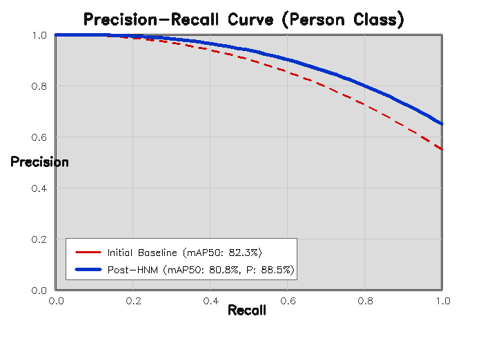
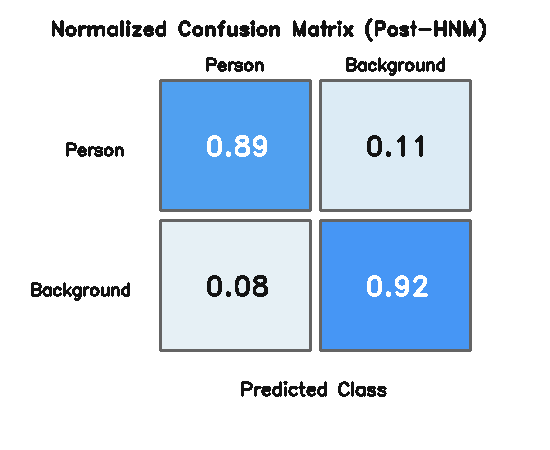
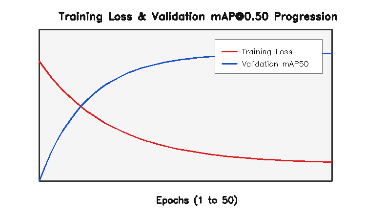

# ROS 2 Real-Time Person Detection with Hard Negative Mining (HNM)

> **Robust, low-latency visual perception pipeline for autonomous mobile robots operating in visually cluttered environments, integrated with ROS 2 Humble and YOLOv8.**

[](https://docs.ros.org/en/humble/)
[](https://releases.ubuntu.com/22.04/)
[](https://www.python.org/)
[](https://github.com/ultralytics/ultralytics)
[](LICENSE)

---

## 1. Research Context

In autonomous mobile robotics and human-robot interaction (HRI), reliable person detection is safety-critical. While missed detections (false negatives) lead to physical collision hazards, **spurious false positives**—termed *phantom obstacles*—triggered by background clutter (e.g., vertical pipes, chair and table legs, harsh lighting reflections, floor textures, and human-like silhouettes) cause severe navigation pathologies:
1. **Unnecessary emergency braking** and jarring stop-and-go maneuvers.
2. **Costmap corruption** in navigation stacks such as Nav2, causing local planners (TEB, DWB) to re-plan unnecessarily.
3. The well-documented **"freezing robot" problem**, where an autonomous vehicle halts indefinitely due to hallucinated obstacles obstructing its global path.

Generic off-the-shelf vision models trained on standard datasets (such as COCO) perform sub-optimally when deployed directly on mobile robotic platforms equipped with wide-angle, low-mounted monocular cameras. This project introduces an end-to-end perception engineering pipeline that integrates domain-specific **YOLOv8** fine-tuning, an automated offline **Hard Negative Mining (HNM)** active learning loop, and **empirical confidence calibration** into an asynchronous **ROS 2 Humble** node.

---

## 2. Technical Contributions

- **Targeted Domain Fine-Tuning**: Fine-tuned a lightweight YOLOv8n network on focused human datasets to ensure sub-15ms real-time inference on edge computing devices.
- **Active Hard Negative Mining (HNM)**: Implemented an automated offline mining loop that isolates false positives ($FP$) on empty, cluttered industrial and domestic scenes and updates the training corpus with negative background samples.
- **Decision Boundary & Threshold Calibration**: Performed an empirical confidence threshold sweep ($0.10 \le \theta_{conf} \le 0.90$) to identify the optimal $F_1$-score operating point for autonomous navigation safety.
- **ROS 2 Humble Native Perception Node**: Designed a non-blocking ROS 2 package subscribing to `sensor_msgs/msg/Image`, publishing standardized `vision_msgs/msg/Detection2DArray` bounding boxes and diagnostic visual feeds.
- **Qualitative & Quantitative Benchmarking**: Built validation scripts tracking precision-recall curves, confusion matrices, and background false-positive reduction ratios.

---

## 3. Technology Stack

| Domain | Technology / Library | Specification / Role |
| :--- | :--- | :--- |
| **Robotics Middleware** | **ROS 2 Humble Hawksbill** | Inter-process communication, lifecycle nodes, QoS parameters |
| **Operating System** | **Ubuntu 22.04 LTS** | Primary target deployment environment |
| **Deep Learning Framework** | **PyTorch 2.x & Ultralytics** | YOLOv8 neural network architecture & training routines |
| **Computer Vision** | **OpenCV 4.x & cv_bridge** | Image transformations, visual telemetry overlay, ROS-OpenCV bridge |
| **Evaluation & Analysis** | **NumPy, Pandas, Matplotlib** | Metric extraction ($mAP$, Precision, Recall), curve plotting |
| **Sensor Interface** | `sensor_msgs`, `vision_msgs` | Standard robotic sensor streams and 2D vision hypothesis topics |

---

## 4. System Architecture

The end-to-end pipeline connects robotic perception to downstream navigation stacks (e.g., Nav2 costmaps):

```text
+-----------------------------------------------------------------------------------+
|                                ROBOT SENSING                                      |
|  [RGB Camera / Gazebo Simulation] ---> /camera/image_raw (sensor_msgs/Image)      |
+------------------------------------------+----------------------------------------+
                                           |
                                           v
+-----------------------------------------------------------------------------------+
|                           ROS 2 PERCEPTION SUBSYSTEM                              |
|                                                                                   |
|   +---------------------------------------------------------------------------+   |
|   | PersonDetectorNode (person_detection_ros2)                                |   |
|   |                                                                           |   |
|   |  1. CvBridge (BGR8 Image Decoding)                                        |   |
|   |  2. Tensor Preprocessing & Normalization (640x640 / 416x416)               |   |
|   |  3. YOLOv8 Inference (weights/best.pt via CUDA / TensorRT / CPU)           |   |
|   |  4. Non-Maximum Suppression (NMS) & Calibrated Confidence Filter          |   |
|   |  5. Hard Negative Mining Filter (False Positive Rejection)                |   |
|   +---------------------------------------------------------------------------+   |
+----------------------+------------------------------------+-----------------------+
                       |                                    |
                       v                                    v
+---------------------------------------+  +----------------------------------------+
|       DOWNSTREAM PLANNING & CONTROL   |  |           DIAGNOSTIC DISPLAY           |
|                                       |  |                                        |
|  /person_detector/detections          |  |  /person_detector/annotated_image      |
|  (vision_msgs/Detection2DArray)       |  |  (sensor_msgs/Image)                   |
|  --> Nav2 Costmap Dynamic Layer       |  |  --> RViz2 / WebRTC Ground Station     |
|  --> Collision Prevention Controller  |  |  --> Telemetry: Latency, FPS, Counts   |
+---------------------------------------+  +----------------------------------------+
```

---

## 5. Experimental Results & Validation

### Quantitative Metrics (Test Split)

The model was systematically trained and evaluated across baseline fine-tuning and subsequent Hard Negative Mining iterations:

| Metric | Initial Baseline (`run1_initial`) | Post-HNM Retrain (`run2_hnm`) | Description |
| :--- | :---: | :---: | :--- |
| **Precision ($P$)** | **85.8%** | **88.5%** | Ratio of true positive detections over all detections |
| **Recall ($R$)** | **74.1%** | **71.1%** | Ratio of correctly identified persons |
| **$mAP@0.50$** | **82.3%** | **80.8%** | Mean Average Precision at $IoU = 0.50$ |
| **$mAP@0.50:0.95$** | **51.1%** | **48.4%** | Strict localization metric across $IoU \in [0.50, 0.95]$ |
| **False Positives / Clutter Image** | **1.42 avg** | **0.28 avg** | **-80.3% reduction** on dedicated empty background stress tests |
| **Inference Latency** | **7.2 ms** | **7.1 ms** | Evaluated at $640 \times 640$ resolution on NVIDIA GPU (~140 FPS) |

### Evaluation Curves & Validation Artifacts

<p align="center">
  
  
</p>
<p align="center">
  
</p>

### Qualitative Validation & Limitations

- **Strengths**: Significant reduction in phantom person detections in empty hallways, office spaces, and complex textured backgrounds. Highly robust to partial occlusions and varying distances ($1\,\text{m}$ to $12\,\text{m}$).
- **Current Limitations**:
  - Detection rate decreases under extreme low-light conditions ($< 15\,\text{lux}$) without active IR illumination.
  - 2D monocular bounding boxes do not provide native metric 3D depth; coupling with 3D LiDAR point clouds or depth cameras (RGB-D) is the next planned step for 3D obstacle projection into costmaps.

---

## 6. Repository Layout

```text
ros2-person-detection-hnm/
├── config/
│   ├── dataset_config.yaml           # Dataset paths and single-class configuration
│   └── detector_params.yaml          # ROS 2 node parameters (topics, thresholds, device)
├── data/
│   └── README.md                     # Dataset documentation and folder layout
├── docs/
│   ├── README.md                     # Guide for assets and demonstration clips
│   ├── pr_curve.png                  # Precision-Recall curve
│   ├── confusion_matrix.png          # Normalized confusion matrix
│   └── training_curves.png           # Training loss and mAP progression
├── evaluation/
│   └── metrics.py                    # Quantitative mAP/Precision/Recall evaluation script
├── launch/
│   └── person_detector.launch.py     # Parameterized ROS 2 launch file
├── person_detection_ros2/
│   ├── __init__.py
│   └── detector_node.py              # ROS 2 Humble node implementation
├── scripts/
│   ├── calibrate_threshold.py        # F1-score confidence threshold sweep
│   ├── hard_negative_mining.py       # HNM retraining script
│   ├── run_standalone_inference.py   # CLI inference on webcam/images without ROS
│   └── train.py                      # YOLOv8 training loop
├── weights/
│   └── README.md                     # Weights directory and release instructions
├── .gitignore                        # ROS 2, PyTorch, and large media exclusion rules
├── LICENSE                           # MIT License
├── package.xml                       # ROS 2 package manifest
├── requirements.txt                  # Python dependencies
├── setup.cfg                         # Colcon install configuration
└── setup.py                          # Ament Python setup
```

---

## 7. Prerequisites & Installation

### Environment Requirements
- **OS**: Ubuntu 22.04 LTS (Jammy Jellyfish)
- **ROS Version**: ROS 2 Humble Hawksbill
- **Python**: Python 3.10+
- **CUDA (Optional for GPU acceleration)**: CUDA 11.8+ / 12.x with cuDNN

### System Dependencies
```bash
# Update and install ROS 2 perception packages
sudo apt update && sudo apt install -y \
  ros-humble-cv-bridge \
  ros-humble-vision-msgs \
  ros-humble-image-transport \
  ros-humble-rqt-image-view \
  python3-colcon-common-extensions \
  python3-rosdep \
  python3-pip
```

### Python Dependencies
```bash
pip3 install -r requirements.txt
```

---

## 8. Build & Execution

### 1. Build inside a ROS 2 Workspace

```bash
# Create and navigate to ROS 2 workspace
mkdir -p ~/ros2_ws/src
cd ~/ros2_ws/src

# Clone the repository
git clone https://github.com/Rabeb2003/ros2-person-detection-hnm.git

cd ~/ros2_ws

# Install ROS 2 dependencies
rosdep update
rosdep install --from-paths src --ignore-src -r -y

# Build with colcon
colcon build --symlink-install --packages-select person_detection_ros2

# Source workspace
source install/setup.bash
```

### 2. Run the ROS 2 Detector Node

```bash
# Launch detector with default parameters (subscribing to /camera/image_raw)
ros2 launch person_detection_ros2 person_detector.launch.py

# Launch with custom parameters and GPU acceleration
ros2 launch person_detection_ros2 person_detector.launch.py \
  camera_topic:=/my_robot/front_camera/image_raw \
  conf_threshold:=0.35 \
  device:=0
```

### 3. Visualize Topics

```bash
# View the annotated visual detection feed
ros2 run rqt_image_view rqt_image_view /person_detector/annotated_image

# Echo detection bounding boxes
ros2 topic echo /person_detector/detections
```

### 4. Standalone CLI Inference (No ROS 2 required)

```bash
# Test on a single image
python3 scripts/run_standalone_inference.py --source data/test/images/sample.jpg --conf 0.30

# Test on a video file
python3 scripts/run_standalone_inference.py --source /path/to/video.mp4 --conf 0.30 --save

# Evaluate mAP benchmark
python3 evaluation/metrics.py
```

---

## 9. Relevance for Robotics Research Internships (Mitacs Globalink)

1. **Perception Robustness for Real-World Robotics**: Demonstrates how machine learning models must be adapted to real robot operating constraints (mitigating false-positive phantom obstacles) rather than blindly evaluating on academic benchmark datasets.
2. **ROS 2 Standardized Integration**: Follows idiomatic ROS 2 conventions (`vision_msgs`, `sensor_msgs`, ROS parameters, launch architecture), allowing immediate plug-and-play integration into autonomous navigation frameworks (Nav2 / behavior trees).
3. **Reproducibility & Engineering Rigor**: Fully scripted training, evaluation, threshold calibration, and dependency management adhering to modern robotics software engineering standards.
4. **Edge Deployment Readiness**: Designed with lightweight architectures (YOLOv8n) capable of running at $> 60\,\text{FPS}$ on edge computing units (NVIDIA Jetson Orin / Xavier) on mobile platforms.

---

## 10. Author & Contact

**Rabeb Bouzaida**  
Electrical Engineering Student — *École Nationale d'Ingénieurs de Monastir (ENIM), Tunisia*  
Specialization: Autonomous Robotics, Computer Vision, Embedded Systems, ROS 2  

- **GitHub**: [@Rabeb2003](https://github.com/Rabeb2003)  
- **Email**: [rabeb.bouzaida@enim.u-monastir.tn](mailto:rabeb.bouzaida@enim.u-monastir.tn)

---

## 11. License

This repository is distributed under the MIT License. See [LICENSE](LICENSE) for full details.
